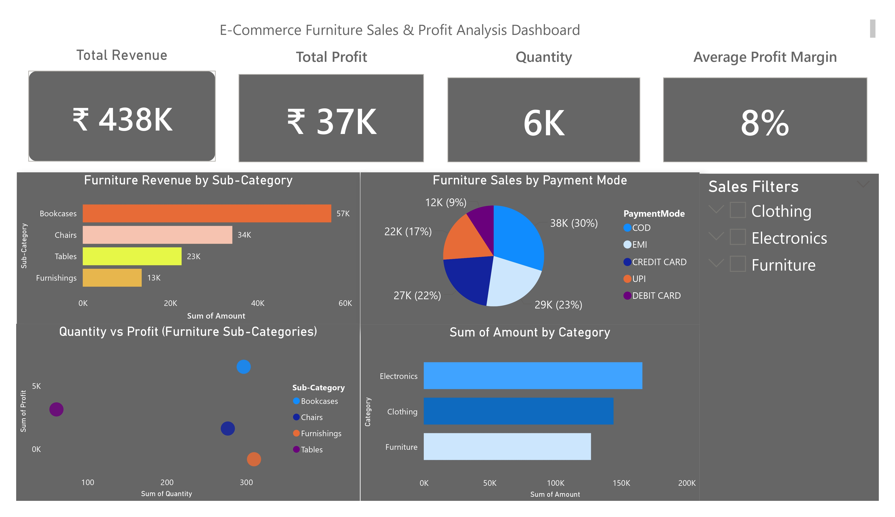

# E-Commerce Furniture Analysis

A data analytics project built using Python and Power BI to analyze e-commerce furniture sales data and uncover insights related to revenue, profit, customer purchasing behavior, and payment trends.

This project focuses on understanding sales performance across furniture sub-categories, profitability patterns, quantity impact, and payment mode preferences, and transforming these insights into business-ready visual dashboards and actionable recommendations


---

## 📌 Table of Contents
- [About the Project](#about-the-project)
- [Features](#features)
- [Tech Stack](#tech-stack)
- [Analysis Workflow](#analysis-workflow)
- [Project Structure](#project-structure)
- [Installation](#installation)
- [Usage](#usage)
- [Screenshots](#screenshots)
- [Future Enhancements](#future-enhancements)
- [Conclusion](#conclusion)
- [Author](#author)

---

## About the Project

The E-Commerce Furniture Analysis project performs an end-to-end analysis of transactional e-commerce sales data with a strong focus on the Furniture category.

The primary goal of this project is to demonstrate core data analyst skills, including:

- Data understanding and cleaning
- Exploratory Data Analysis (EDA)
- Category and sub-category level performance analysis
- Profitability and quantity relationship analysis
- Business-focused insights
- Interactive dashboard creation using Power BI

The project covers:

- Cleaning and preprocessing raw e-commerce sales data
- Creating meaningful features such as profit margin
- Performing structured exploratory analysis using Python
- Building an interactive Power BI dashboard for decision-making
- Delivering business-oriented insights and recommendations

---

## Features

- 🧹 Data cleaning and preprocessing using Python (Pandas)
- 📊 Exploratory Data Analysis (EDA) on sales, profit, and quantity
- 🪑 Furniture-focused sub-category performance analysis
- 💰 Profit margin and profitability insights
- 💳 Payment mode behavior analysis (EMI, COD, Credit Card)
- 📈 Interactive Power BI dashboard for insights and storytelling
- 📌 Business-oriented recommendations for revenue and profit optimization

---

## Tech Stack

- **Language:** Python
- **Libraries:** Pandas, NumPy, Matplotlib, Seaborn
- **Visualization:** Power BI
- **Working Environment:** Jupyter Notebook

---

## Analysis Workflow

- Raw e-commerce sales data ingestion and validation
- Data cleaning and preprocessing
- Feature engineering (Profit Margin)
- Exploratory Data Analysis (EDA)
- Furniture-focused deep dive analysis
- Payment behavior and quantity vs profit analysis
- Dashboard creation using Power BI
- Business-ready insights and recommendations

---
## Project Structure

```bash
e-commerce-furniture-analysis/
│
├── 📁 dataset/
│   ├── 📁 raw/
│   │   └── e-commerce_dataset.csv
│   └── 📁 cleaned/
│       └── cleaned_e-commerce_dataset.csv
│
├── 📁 notebooks/
│   ├── 01_data_understanding.ipynb
│   ├── 02_data_cleaning.ipynb
│   ├── 03_exploratory_data_analysis.ipynb
│   ├── 04_furniture_focus_analysis.ipynb
│   └── 05_visualization_and_insights.ipynb
│
├── 📁 visuals/
│   ├── sales-distribution.png
│   ├── category-wise.png
│   ├── furniture-revenue.png
│   ├── profit-margin.png
│   └── qty-profit.png
│
├── 📁 dashboard/
│   ├── dashboard.pbix
│   └── 📁 dashboard_image/
│       └── dashboard.png
│
├── requirements.txt
│
└── README.md
```

---

## Installation

Clone the repository

```bash
git clone https://github.com/Sujaltyagi09/e-commerce-furniture-analysis.git


```
Navigate to the Project Directory

```bash
cd e-commerce-furniture-analysis

```

Install Dependencies

```bash
pip install -r requirements.txt
```

---

## Usage

- Run Jupyter notebooks sequentially from the notebooks/ folder
- Use the cleaned dataset for all analysis steps
- Open the Power BI file (.pbix) from the dashboard/ folder to explore interactive dashboards
- Review insights and recommendations from the final notebook and dashboard

---

## Screenshots

### Power BI Dashboard
<p align="center">  </p>

---

## Future Enhancements

- Adding time-series sales trend analysis
- Forecasting furniture sales using machine learning
- Region-wise or customer-level analysis
- Enhancing dashboard with drill-through pages
- Automating data refresh pipelines

---

## Conclusion

This project demonstrates a complete data analytics lifecycle applied to the e-commerce furniture domain. It highlights strong analytical thinking, profitability analysis, and effective dashboard-driven storytelling, making it highly relevant for Data Analyst and Business Analyst roles.

---

## Author

Sujal Tyagi
- [Github](https://www.github.com/Sujaltyagi09)
- [LinkedIn](https://www.linkedin.com/in/sujal-tyagi-3ba820296/)
- [Email](sujaltyagi906@gmail.com)

